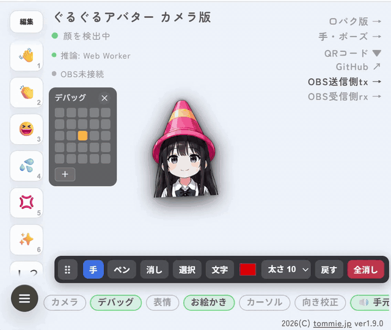
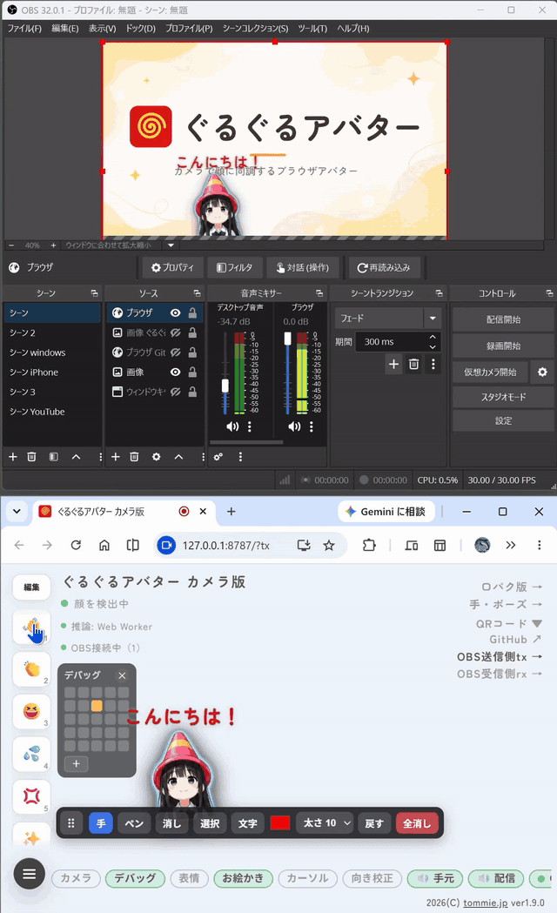

<div align="center">

# ぐるぐるアバター 🌀

Webカメラで顔の向き・口の動きに同調する、配信向けブラウザアバター

[](LICENSE)
[](https://vite.dev/)
[](https://react.dev/)
[](https://ai.google.dev/edge/mediapipe)
[](https://github.com/tommie-jp/guruguru-avatar/actions/workflows/pages.yml)

[](https://tommie-jp.github.io/guruguru-avatar/)

[](docs/OBS-v1.9.0-edit.gif)

## [🎥 ライブデモを開く](https://tommie-jp.github.io/guruguru-avatar/)

</div>

---

## ✨ 特徴

- 🎥 **カメラ顔追従** — MediaPipe FaceLandmarker（Web Worker で推論）で顔の向きを推定し、**25方向**のフレームに同調
- 👄 **口パク** — 口の開きに合わせて 3 段階（とじ / はんびらき / ぜんかい）で切り替え
- 😉 **まばたき** — 目を閉じたタイミングや自動まばたきに連動
- 🎭 **複数アバター** — セレクタで切り替え（`?avatar=<id>` で固定）。自作キャラの追加にも対応
- 📺 **OBS 透過オーバーレイ** — `?obs=1` で背景透過・UI 非表示。配信にそのまま重ねられる
- 📡 **WS 中継（tx/rx）** — スマホや別ブラウザで推論した動きを OBS 側へ送信（`?tx` / `?rx`）
- 🔊 **サウンドボード＆演出** — 効果音・スタンプ・ジェスチャー（回転／うなずく／No ほか）をワンタップで発火、配信側にも同期
- ✍️ **お絵かきオーバーレイ** — 配信画面に手描きできる（rx へライブ同期）
- 📱 **PWA / 🪟 Windows アプリ** — ホーム画面に追加（PWA）、Node 不要の単体 exe（Electron）
- 🗣 **複数モード同梱** — マイク音量で動くトーク版、マウス追従のぐるぐる版、手・ポーズ可視化のトラッキング版

> フォーク元の [rotejin/tomari-guruguru](https://github.com/rotejin/tomari-guruguru)（マウス追従＋口パク）を、
> Webカメラで顔に同調するように拡張したものです。

---

## 🚀 クイックスタート

必要環境: **Node.js 22 LTS 推奨**（Vite 8 の要件は Node.js 20.19+ または 22.12+）。

```bash
git clone https://github.com/tommie-jp/guruguru-avatar.git
cd guruguru-avatar
npm install
npm run dev
```

- `npm run dev` で `/`（index.html・カメラ版）が自動で開きます（MediaPipe アセットのコピーも自動実行）。
- dev サーバーには WS 中継（`/__relay`）が同居しているので、`npm run dev` だけで `?tx` / `?rx` の送受信も試せます。
- カメラは secure context が必要です。`http://localhost:5173/` または `127.0.0.1` で開いてください。
- WSL は自動判定で `0.0.0.0` にバインドします。Windows 側の Chrome からは起動ログの `Network:` の URL で開けます。
- `.env.local` は通常不要です（ヘッドレスやリモート閲覧で明示上書きしたいときだけ `.env.local.example` を利用）。

---

## 🕹 モードとエントリ

| モード | エントリ | 内容 |
| --- | --- | --- |
| **カメラ版**（主役） | `index.html` | Webカメラで顔の向き・口に同調・Pixi スプライト描画・複数アバター選択。サイトのトップ（旧 `camera2.html`） |
| トーク版 | `talk.html` | マイク入力／音声ファイルに合わせて口パク |
| ぐるぐる版 | `guruguru.html` | マウス追従で25方向に振り向く |
| トラッキング | `tracking.html` | 手・体のポーズを推定して可視化するデモ |
| 旧トップ | `index_old.html` | `index.html` へ自動転送（旧 `index.html`） |
| 互換リダイレクト | `camera2.html` | `index.html` へ自動転送（OGPキャッシュ・旧共有リンク対策） |

---

## 📺 OBS・配信で使う

カメラ版はそのまま OBS のブラウザソースに重ねられます。

- `index.html?obs=1` … **ステージモード**（背景透過＋UI 非表示。アバターだけを表示）
- `index.html?tx` / `index.html?rx` … **WS 中継**。スマホや別ブラウザで推論した動きを OBS の CEF（rx）へ送る（[docs-camera/11-WS中継の接続手順.md](docs-camera/11-WS中継の接続手順.md)）
- `?avatar=` / `?camera=` で OBS のシーンごとにアバターとカメラを固定できる（[docs-camera/16-URLパラメータ一覧.md](docs-camera/16-URLパラメータ一覧.md)）
- 影の濃さは Tweaks パネルの「影の濃さ」(0〜6) で調整（旧 `?shadow=N` は廃止）
- ステージモード中は **`T` キー**で Tweaks パネルを開閉
- 手順の詳細は [docs-camera/10-OBSでライブ配信.md](docs-camera/10-OBSでライブ配信.md)
- Node 不要の Windows アプリ（exe）で使う場合は [docs-camera/12-Windowsアプリの使い方.md](docs-camera/12-Windowsアプリの使い方.md)（ビルド方法は [docs-camera/58-WindowsアプリにするElectron.md](docs-camera/58-WindowsアプリにするElectron.md)）

OBS で使う場合は、Tweaks の背景色をクロマキーしやすい色に調整するのも有効です。

---

## ⚙️ 仕組み（フレーム画像）

向きと表情に応じて `public/slices2/<状態>/r<行>c<列>.webp` を1枚ずつ切り替えています。

<details>
<summary><b>25方向 × 6状態のマッピングを見る</b></summary>

### 25方向（5列 × 5行）

- 列 `c0`〜`c4`: 左向き → 左斜め → **正面** → 右斜め → 右向き
- 行 `r0`〜`r4`: 強く上 → 少し上 → **水平** → 少し下 → 強く下

### 6状態（目 × 口）

| フォルダ | 目 | 口 |
| --- | --- | --- |
| `A` | 開け | とじ |
| `B` | 開け | 中間 |
| `C` | 開け | 開け |
| `D` | 閉じ | とじ |
| `E` | 閉じ | 中間 |
| `F` | 閉じ | 開け |

画像パス例: `slices2/A/r2c2.webp`（正面・目開け・口とじ）。
アバターの登録は [src/character-config.js](src/character-config.js) の `AVATAR_DEFS` で一元管理しています
（追加アバターは `public/slices2-sheets/<id>/A〜F.webp` のシート方式。
[docs-camera/31-アバターの追加.md](docs-camera/31-アバターの追加.md)）。

</details>

---

## 🎨 自分のキャラで作る

<details>
<summary><b>5×5角度シート 6枚から差し替える手順</b></summary>

最終的に **5×5角度シートを6枚**（`A`〜`F` = 目の開閉 × 口の開き）用意します。

```text
A_目開け_口とじ.png
B_目開け_口中間.png
C_目開け_口開け.png
D_目閉じ_口とじ.png
E_目閉じ_口中間.png
F_目閉じ_口開け.png
```

おすすめの流れ:

1. 自分のキャラクター参照画像を用意する
2. `docs/01_画像生成用テンプレ.png` と `docs/01_画像生成用プロンプト.txt` を画像生成 AI に渡して
   6枚のシートを作る（`./doGenGptImage.sh` で自動化も可）
3. `./doAvatarConvert.sh` でシートを表示用（`public/slices2-sheets/<id>/`）へ変換する
4. `./doAvatarConfig.sh` で設定の雛形を作り、`src/character-config.js` の `AVATAR_DEFS` に登録する

詳しい注意点や検証方法は [docs/新キャラ差し替え手順.md](docs/新キャラ差し替え手順.md)・
[docs-camera/31-アバターの追加.md](docs-camera/31-アバターの追加.md)・
[docs-camera/32-アバター画像の生成AI.md](docs-camera/32-アバター画像の生成AI.md) を参照してください。

</details>

---

## 🛠 開発

```bash
npm run dev       # 開発サーバー（127.0.0.1:5173、/ index.html が自動で開く。WS 中継も同居）
npm test          # Vitest（ユニットテスト）
npm run lint      # ESLint
npm run build     # 本番ビルド（dist/ 出力）
npm run preview   # ビルド結果を確認（/guruguru-avatar/ ベースで起動）
```

実作業は `do*.sh` ラッパー経由が便利です（`./doStartDev.sh` / `./doTest.sh` / `./doDeploy.sh` /
`./doAvatarConvert.sh` など。各スクリプトの `-h` で usage を表示）。

`preview` は GitHub Pages と同じ `/guruguru-avatar/` のベースパスで動きます。

```text
http://127.0.0.1:4173/guruguru-avatar/
```

---

## 🧩 技術スタック

- **Vite 8** — ビルド・開発サーバー（マルチエントリ。`vite-plugin-relay.mjs` で WS 中継を同居）
- **React 18** — UI
- **PixiJS 8** — アバターのスプライト描画・エフェクト
- **@mediapipe/tasks-vision** — 顔・手・ポーズの推論（FaceLandmarker ほか。Web Worker で実行）
- **fabric.js** — お絵かきオーバーレイ
- **ws** — WS 中継サーバ（`server/relay.mjs`）
- **vite-plugin-pwa** — PWA（ホーム画面追加）
- **Electron** — Windows 単体アプリ（中継内蔵）
- **Vitest** — ユニットテスト

---

## 📁 構成

```text
.
├── index.html              # トップ＝主役（カメラ版・Pixi／複数アバター。旧 camera2.html）
├── talk.html               # トーク版エントリ
├── guruguru.html           # ぐるぐる版エントリ
├── tracking.html           # トラッキング版エントリ
├── index_old.html          # index.html へのリダイレクト（旧 index.html）
├── camera2.html            # index.html へのリダイレクト（OGPキャッシュ/旧リンク対策）
├── vite.config.js          # 本家と字面一致を保つ素の設定
├── vite.fork.js            # フォーク固有の設定（エントリ／WSL／base）
├── vite-plugin-relay.mjs   # dev/preview に WS 中継（/__relay）を同居させるプラグイン
├── src/
│   ├── camera-app.jsx      # カメラ版本体（Pixi・複数アバター）
│   ├── talk-app.jsx        # トーク版本体
│   ├── app.jsx             # ぐるぐる版本体
│   ├── tracking-app.jsx    # トラッキング版本体
│   ├── face/               # 顔ランドマーク推論・向き校正（Web Worker）
│   ├── tracking/           # 手・ポーズ推論
│   ├── sprite-avatar/      # PixiJS スプライト描画・エフェクト
│   ├── audio/              # マイク入力
│   ├── cue-system.js       # サウンドボード／キュー演出（cue-audio / cue-stamp ほか）
│   ├── gestures.js         # ジェスチャー演出（回転・うなずく・No ほか）
│   ├── draw-layer.jsx      # お絵かきオーバーレイ（draw-live / draw-mode ほか）
│   ├── relay-mode.js       # ?tx / ?rx / ?relay= の解釈
│   ├── obs-mode.js         # ?obs= などの URL パラメータ解釈
│   ├── tweaks-panel.jsx    # 調整パネル（タブ UI・ドラッグ移動）
│   ├── use-tweaks.js       # Tweaks の状態管理
│   └── character-config.js # アバター登録（AVATAR_DEFS）
├── server/                 # WS 中継（relay.mjs / relay-core.mjs・TLS プロキシ・静的配信）
├── electron/               # Windows 単体アプリ（Electron・中継内蔵）
├── windows/                # Windows 用の起動 bat・リリーステスト
├── scripts/                # MediaPipe アセット配置／Pages 検証
├── public/
│   ├── slices2/            # スライス済みキャラ画像（既定アバター・Git 追跡）
│   ├── slices2-sheets/     # 追加アバターの packed シート（<id>/A〜F.webp）
│   ├── mediapipe/          # MediaPipe モデル（npm script で配置）
│   └── ogp.png             # OGP 画像
├── docs/                   # 画像生成・キャラ差し替え資料・README 素材
├── docs-camera/            # カメラ版の使い方・OBS 配信・WS 中継などの手順
├── tools/slice_character_sheets.py
├── do*.sh                  # 補助スクリプト（各 -h で usage 表示）
├── LICENSE                 # プログラム（MIT）
├── ASSET_LICENSE.md        # 画像・音声（非商用）
└── README.md
```

---

## 🚢 デプロイ

GitHub Pages で公開しています（base = `/guruguru-avatar/`）。push では自動デプロイされないため、
`workflow_dispatch` を手動トリガーします。リポジトリ直下の `doDeploy.sh` が起動から完了監視・反映確認、
Windows アプリ（Electron の NSIS インストーラ＋ポータブル exe）のリリースと実機 E2E までを行います（`pages` / `win` 指定可、既定は両方）。

```bash
git push origin main
./doDeploy.sh
```

公開URL: [https://tommie-jp.github.io/guruguru-avatar/](https://tommie-jp.github.io/guruguru-avatar/)
（トップ `/` ＝ `index.html`・カメラ版）

---

## 📜 ライセンス

**プログラム** と **キャラクター素材・音声** でライセンスを分けています。

- **プログラム部分**: [MIT License](LICENSE)
- **キャラクター画像・キャラクターシート・スライス済みフレーム・音声・生成素材**: MIT License の **対象外**です。
  - 既定アバター「トマリ」の画像・音声は **フォーク元 [rotejin](https://github.com/rotejin/tomari-guruguru) 氏（原作者）の著作物**です。
    本フォークは許諾の範囲で同梱しているだけで、これらの素材に対する著作権を主張しません。
    非商用の範囲での SNS 投稿などは可能ですが、商用利用・他プロジェクトへの流用・再配布・改変・AI 学習などは禁止です。
    詳細な条件は [ASSET_LICENSE.md](ASSET_LICENSE.md) を参照してください。
  - 同梱のほかのアバター（いらすとや素材・生成 AI 製ほか）も各権利元の条件に従います（原則 非商用）。
    各アバターの出どころは、アプリ内のクレジット表示（Tweaks／フッター）と
    [src/character-config.js](src/character-config.js) の `credit` / `attribution` を参照してください。

---

## 🙏 クレジット

フォーク元: [rotejin/tomari-guruguru](https://github.com/rotejin/tomari-guruguru)（トマリぐるぐる／トマリトーク）。
向きと表情のフレーム切り替えという発想と、トーク／ぐるぐる版のベースはフォーク元によるものです。

アバター素材: トマリ（ろてじん さん）のほか、[いらすとや](https://www.irasutoya.com/) 素材・
わんたん@減量中 さん・生成 AI（ChatGPT）製のアバターを同梱しています。
各アバターの帰属はアプリ内のフッターに表示されます。
