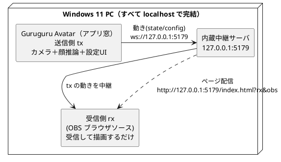

# デスクトップアプリの使い方（OBS向け・Windows / Linux）

OBS で「ぐるぐるアバター」を透過オーバーレイ表示するための、デスクトップアプリ
（Electron・WS 中継サーバ内蔵）の使い方。ランタイムは同梱されているので、
**Node も Bun もインストール不要**。すべて `localhost` で動くので TLS も
ファイアウォール開放も要らない（スマホをカメラにする場合のみ Tailscale を使う）。

- ダウンロード: [リリースページ](https://github.com/tommie-jp/guruguru-avatar/releases/latest)
- 実行確認は Windows 11 のみ。Linux（AppImage）は WSL2/WSLg での起動確認のみ。
- macOS 向けバイナリは配布していません（「[macOS で使う](#macos-で使う配布物なし)」参照）。

> 旧 zip 配布（`guruguru-relay.exe` + `start.bat`、win-v1.9.x 以前）から移行する場合は、
> 末尾の「[旧 zip からの移行](#旧-zip-からの移行)」を参照。

## しくみ（ざっくり）

- **送信側 tx** … アプリの窓そのもの。カメラと顔推論を動かす（感度・口・影などの設定 UI もここ）。
- **受信側 rx** … OBS のブラウザソース（＝**CEF**＝OBS 内蔵ブラウザ）。カメラは使わず、tx の動きで描画するだけ。
- **中継サーバ** … アプリに内蔵。tx の動きを rx へ中継し、同じポートでページも配る（`127.0.0.1:5179`）。

OBS 側(rx)はカメラを使わないので、**OBS に `--enable-media-stream` を付ける必要はない**。



## 1. ダウンロードして起動する

[リリースページ](https://github.com/tommie-jp/guruguru-avatar/releases/latest)からどちらか
一方をダウンロードする。

| ファイル | 形式 |
| --- | --- |
| `GuruguruAvatar-Setup-<version>.exe` | Windows インストーラ（デスクトップショートカット作成・アンインストーラ付き） |
| `GuruguruAvatar-<version>-portable.exe` | Windows インストール不要の単体 exe（起動するだけ） |
| `GuruguruAvatar-<version>-linux-x86_64.AppImage` | Linux 用の単体アプリ（x86_64。「[Linux で使う](#linux-で使うappimage)」参照） |

1. exe を実行する。初回に **SmartScreen**（発行元不明）が出たら
   ［詳細情報］→［実行］（コード署名をしていないため。個人配布なら通常これで十分）。
2. アプリの窓が開き、送信側 tx（カメラ画面）になる。**カメラを許可**して顔を動かすと
   アバターが追従する。
3. インストーラ版のインストール先は `%LOCALAPPDATA%\Programs\Guruguru Avatar\`（ユーザー単位）。

## 2. OBS に受信側(rx)を設定する

1. OBS で「ソース」→「＋」→「**ブラウザ**」を追加する。
2. 次のように設定する。

   | 項目 | 値 |
   | --- | --- |
   | URL | `http://127.0.0.1:5179/index.html?rx&obs` |
   | 幅 / 高さ | 配置したいサイズ（例 `1080` × `1080`） |
   | ソースが非アクティブのときシャットダウン | OFF（接続を温存する） |

3. `?rx&obs` は**背景透過＋UI 非表示**なので、そのままオーバーレイにできる。

## 接続を確認する

- アプリ窓の画面下に「**OBS接続中（1）**」が出れば結線 OK
  （数字は接続中の OBS ブラウザソース数）。
- アプリ窓で顔を振る・口を開けると OBS の rx が同調する。
- 見た目の調整（影の濃さ・口・ズーム等）はアプリ窓で **`T` キー** → Tweaks パネル。
  変更した設定は rx(OBS) に同期される。

## Linux で使う（AppImage）

`GuruguruAvatar-<version>-linux-x86_64.AppImage` は Linux 用の単体アプリ。使い方は
Windows と同じ（アプリ窓＝tx、OBS のブラウザソースに
`http://127.0.0.1:5179/index.html?rx&obs`）。

```bash
chmod +x GuruguruAvatar-<version>-linux-x86_64.AppImage
./GuruguruAvatar-<version>-linux-x86_64.AppImage
```

- **「AppImages require FUSE」と出る場合**（Ubuntu 22.04+ / WSL など libfuse2 が無い環境）は、
  次のどちらか:
  - `--appimage-extract-and-run` を付けて実行する（sudo 不要・その場で動く）:

    ```bash
    ./GuruguruAvatar-<version>-linux-x86_64.AppImage --appimage-extract-and-run
    ```

  - もしくは先に libfuse2 を導入して、以後は直接実行できるようにする
    （Ubuntu 24.04 以降: `sudo apt install libfuse2t64` ／ 22.04: `sudo apt install libfuse2`）。
- **`--appimage-extract`（`-and-run` なし）は「展開するだけ」で起動はしない**。
  展開後に出る `squashfs-root/AppRun` を実行すれば、FUSE 無しでも起動できる:

  ```bash
  ./GuruguruAvatar-<version>-linux-x86_64.AppImage --appimage-extract  # squashfs-root/ に展開
  ./squashfs-root/AppRun                                               # これで起動
  ```

- ユーザーデータは `~/.config/Guruguru Avatar/` に保存される。

### WSL では起動確認までしかできない（重要）

**AppImage の動作確認は WSL2/WSLg（ビルド機）でのみ行っており、WSL では実アバターは
まともに動かない**。上の手順で確認できるのは「アプリ窓が開き、内蔵サーバが
`127.0.0.1:5179` で応答する」ところまで。理由は 2 つ:

- **カメラが使えない** … WSL は `/dev/video` をパススルーしないため getUserMedia が失敗し、
  顔追従が動かない。
- **PixiJS が描画できない** … WSLg では WebGL が blocklist され、アバターのスプライトが出ない。

顔追従まで実際に試すなら、カメラと GPU が使える**実 Linux デスクトップ**で動かす
（そこはまだ未検証。動作報告・不具合は issue へ）。手元の Windows で試すだけなら
Windows 版 exe の方が確実（[1. ダウンロードして起動する](#1-ダウンロードして起動する)）。

## macOS で使う（配布物なし）

macOS 向けバイナリは配布していない。electron-builder の制約で macOS 向けビルドは
macOS 実機でしかできず、実機での動作確認も署名・公証（Gatekeeper 対策）もできないため。
代わりに次のどちらかを使う。

- **Web 版**: [https://tommie-jp.github.io/guruguru-avatar/](https://tommie-jp.github.io/guruguru-avatar/)
  （ブラウザだけで動く。OBS 連携なしのカメラ同調はこれで十分）
- **ソースから実行**（OBS 連携・WS 中継が必要な場合）:

  ```bash
  git clone https://github.com/tommie-jp/guruguru-avatar.git
  cd guruguru-avatar
  npm install
  npm run build:local && npm start   # 127.0.0.1:8787 で配信＋中継
  ```

  ブラウザで `http://127.0.0.1:8787/?tx` を開き、OBS のブラウザソースには
  `http://127.0.0.1:8787/?rx&obs` を入れる（Node 実行なので Gatekeeper の許可作業も不要）。

## スマホをカメラにする（任意）

アプリ窓の「カメラ源トグル」で **PC カメラ / スマホ** を切り替えられる。スマホ(QR)にすると
QR コードが前面に出て、同一 Tailscale ネットのスマホから読み取って tx にできる（HTTPS が
必要なため Tailscale 前提）。セットアップ手順と動作確認チェックリストは
[58-WindowsアプリにするElectron.md](58-WindowsアプリにするElectron.md) を、Tailscale の
仕組みは [17-localhostとtailscaleを同時に使う.md](17-localhostとtailscaleを同時に使う.md) を参照。

## 停止・アンインストール

- 停止はアプリ窓を閉じるだけ。2 個目を起動しても既存の窓が前面化するだけ（単一インスタンス）。
- インストーラ版のアンインストールは Windows の「設定 → アプリ」から（ショートカットも消える）。
- ポータブル版は終了時に展開物（`%TEMP%\guruguru-avatar-portable`）を自動で片付ける。
- 画面設定などのユーザーデータは `%APPDATA%\Guruguru Avatar` に残る（不要なら手動削除）。

## つまずいたら

- **OBS が真っ黒 / 動かない**: アプリ窓が「OBS接続中」になっているか確認。OBS のブラウザ
  ソースを右クリック →「**キャッシュを更新**」で再読込する。
- **カメラが出ない**: Windows 設定 → プライバシーとセキュリティ → カメラ の許可を確認。
  他アプリがカメラを専有している場合は先に閉じる。
- **ポート 5179 が使用中**: アプリは自動で別ポートに逃げる。実際のポートは**ウィンドウの
  タイトルバー**（`Guruguru Avatar — :ポート番号`）に出るので、OBS の URL をその番号に
  合わせる（恒久対処は 5179 を使っているプロセスを止めること）。
- **タスクトレイ／タスクバーに残った気がする**: タスクマネージャで `Guruguru Avatar` を
  終了する。

## 旧 zip からの移行

win-v1.9.x 以前の zip（`guruguru-relay.exe` + `start.bat`）から移行する場合:

- **OBS の URL を変更する**: `http://localhost:8787/?rx` → `http://127.0.0.1:5179/index.html?rx&obs`
- tx はブラウザではなく**アプリの窓**になる（既定ブラウザは開かない）。
- 旧 zip はそのまま使い続けても動く（最終版は
  [win-v1.9.3](https://github.com/tommie-jp/guruguru-avatar/releases/tag/win-v1.9.3) のアセット）。
- Linux は AppImage（「[Linux で使う](#linux-で使うappimage)」）へ移行する。macOS は
  「[macOS で使う](#macos-で使う配布物なし)」のとおり Web 版 か `npm start` を使う
  （[14-Windowsで動かす.md](14-Windowsで動かす.md) の手順の要点は OS 共通）。

## もっと詳しく

- ソースからビルドして動かす（開発者向け）: [14-Windowsで動かす.md](14-Windowsで動かす.md)
- アプリ（exe）のビルド方法: [58-WindowsアプリにするElectron.md](58-WindowsアプリにするElectron.md)
- OBS にカメラ自体を触らせる構成: [10-OBSでライブ配信.md](10-OBSでライブ配信.md)
- 公開済みリリースの自動テスト: [55-リリースの動作テスト.md](55-リリースの動作テスト.md)
